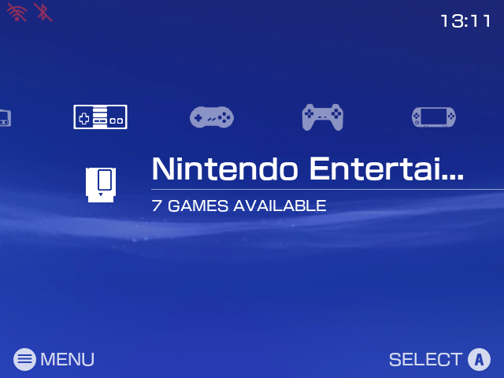
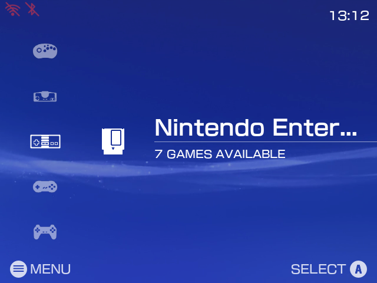
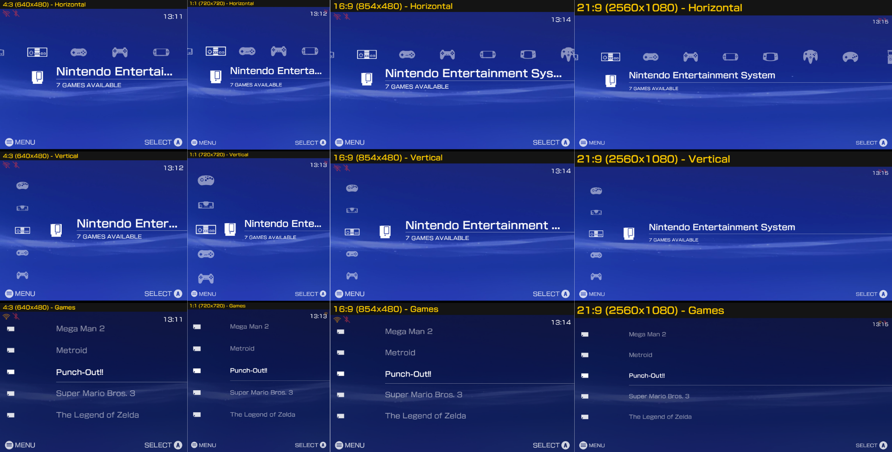

# XMB Theme for EmulationStation

A theme inspired by the XMB (Cross Media Bar) of the PSP and PS3, made for handhelds running EmulationStation. Optimized for **FCAMOD**, the EmulationStation fork by [christianhaitian](https://github.com/christianhaitian/EmulationStation-fcamod), and validated on other frontends (see [Supported Systems](#-supported-systems)).

  
  

<i>System screen: Horizontal (XMB Classic) and Vertical (Left Bar) layouts</i>

  

<i>System screens and game list on 4:3 · 1:1 · 16:9 · 21:9. Single images are in <a href="./screenshots">screenshots/</a>.</i>

## 🌟 Features

- **System screen:** XMB carousel with the selected system's name, game count and physical media icon (cartridge, disc, tape...), or a **Vertical** layout with 5 systems on the left. Every system has an icon; unknown ones show their name.
- **Game list:** PSP style, 5 games per screen, the selected one on the same line as the system screen. Each game shows its logo centered and with its proportions kept (see [Game List Icons](#-game-list-icons)). Names stay on one line (long ones end in "...", the selected one scrolls) and stay visible while scrolling fast. The selected game's image and video (after 2 s) fill the background, darkened.
- **Background:** Animated video that keeps playing while browsing systems, with up to 20 wallpapers (see [Wallpapers](#%EF%B8%8F-wallpapers)).
- **Aspect ratios:** 4:3 (R36S, RG351MP, 640x480), 1:1 (RGB30, R36 Ultra, R36 Pro Max, 720x720), 16:9 (RG503, RGB10 Max, Odroid Go Super, TVs) and 21:9 (ultrawide monitors). Wide screens keep the 4:3 look, with more systems in the carousel.
- **Footer and clock:** Start (menu) and confirm buttons in Nintendo/Xbox or PlayStation (○ ✕) style, and the frontend clock in the top right corner.
- **Menus:** Dark or Light settings menu, including on-screen keyboard text boxes.
- **XMB sounds and fonts:** Full XMB sound set and the original *FOT-NewRodin Pro* fonts.
- **Translated:** Settings follow the frontend language (26 languages; button options in English, Portuguese and Spanish so far).

## 💻 Supported Systems

Validated against each distribution's frontend. Every system they list has a console icon (carousel) and a physical media icon:

| Distribution | Systems |
|---|---|
| [ArkOS](https://github.com/christianhaitian/arkos) | 136 |
| [arkos4clone](https://github.com/lcdyk0517/arkos4clone) | 136 |
| [darkos4clone](https://github.com/lcdyk0517/arkos4clone) | 135 |
| [dArkOS](https://github.com/christianhaitian/dArkOS) | 129 |
| [dArkOSRE-R36](https://github.com/southoz/dArkOSRE-R36) | 126 |
| [dArkOSen](https://github.com/djparentx/dArkOSen-R36S) | 127 |
| [ArchR](https://github.com/archr-linux/Arch-R) | 136 |
| [Batocera](https://batocera.org/) | 260 |
| [EmuELEC](https://github.com/EmuELEC/EmuELEC) | 168 |
| [Knulli](https://knulli.org/) | 242 |

Other FCAMOD-based systems also work. Icons come from the base theme [xmb-menu-es-de](https://github.com/anthonycaccese/xmb-menu-es-de), from [RetroArch Assets](https://github.com/libretro/retroarch-assets), or from an icon of the same hardware or game under another name (e.g. `pce-cd` → PC Engine CD, game ports → Ports); the few systems with no icon anywhere use a generic controller icon.

**Adding an icon:** place `<system theme>.png` in `_inc/systems/controller/` (console) and `_inc/systems/physical-media/` (media). The name must match the system's `<theme>` in `es_systems.cfg` exactly, **including upper/lower case**.

## 📂 Installation

1. Copy the theme folder to your themes directory via SCP/SFTP: usually `/roms/themes/`, `~/.emulationstation/themes/`, or `/userdata/themes/` on Batocera and Knulli. The folder must be named `es-theme-xmb-fcamod` (or `es-theme-xmb-fcamod-main` if downloaded from GitHub). **When updating**, delete the old folder first.
2. Select it in **UI Settings** > **Theme Set**, and customize it in **UI Settings** > **Theme Configuration**:

| Option | Choices (default first) | Notes |
|---|---|---|
| **Aspect Ratio** | 4:3 / 1:1 / 16:9 / 21:9 | Match your screen. |
| **Background Video** | Enabled / Disabled | Disable it on slow devices (less than 1GB of RAM); the wallpaper image is used instead. |
| **Wallpaper** | 1 to 20 | Only `1` is included. |
| **System Layout** | Horizontal (XMB Classic) / Vertical (Left Bar) | The game list follows it. |
| **Color Scheme** | Dark / Light | Settings menu and on-screen keyboard. |
| **Button Icons** | Nintendo / Xbox, PlayStation | PlayStation follows the button position: A = ○, B = ✕. |
| **Confirm Button (A/B)** | A / B | Use **B** if you swapped A/B in the system (**dArkOSen** ships swapped). |

Leave the frontend's **Gamelist View Style** and **Grid Size** on **automatic**: other values replace the theme's game list layout.

## 👾 Game List Icons

Each game shows its **marquee** image. Any size or shape works (wide logos, square art like 720x720, tall images): it is scaled to fit and centered, and names always start on the line. In the scraper, pick **Marquee** or **Wheel** (logo) as the source; both are saved as the marquee. Games without one (e.g. most Ports) show the default game icon, and folders the folder icon.

## 🖼️ Wallpapers

Each wallpaper is a `bg_{number}.png` image plus an optional `bg_{number}.mp4` video (e.g. `bg_2.png`, `bg_2.mp4`) in `_inc/background/`, selected in **Theme Configuration** > **Wallpaper**.

- **Always include the PNG**, ideally the video's first frame: it shows while the video loads and when video is disabled (otherwise the screen stays black).
- Media is stretched to the full screen, so **use your screen's aspect ratio**: 4:3 (1024x768, 640x480), 1:1 (720x720, 1080x1080), 16:9 (854x480, 1280x720, 1920x1080) or 21:9 (2560x1080, 3440x1440).

## ⚠️ Known Limitations

These come from the frontends and cannot be changed by a theme:

- **Sounds:** Stock FCAMOD only plays the navigation, launch and back sounds; select, favorite and quick system select are ignored.
- **Fast scrolling:** FCAMOD hides the selected game's background while you scroll fast; it returns when you stop.
- **A/B swap:** The theme cannot detect it, hence the **Confirm Button (A/B)** option. The full native button legend does not fit small screens in most languages.
- **Batocera, Knulli, ArchR and EmuELEC:** a long name that was scrolling may stay shifted and cut off after you move to another game, until the list is redrawn. FCAMOD is not affected.

## ⚖️ License

This theme is **free** and licensed under [Creative Commons BY-NC-SA 4.0](https://creativecommons.org/licenses/by-nc-sa/4.0/): you may share and adapt it with credit and the same license, but ❌ **selling it is not allowed**, including modified versions and devices, SD cards or images sold with it pre-installed. If you paid for it, you were scammed: the official download is always free at [github.com/jovemlcxx/es-theme-xmb-fcamod](https://github.com/jovemlcxx/es-theme-xmb-fcamod).

Based on [xmb-menu-es-de](https://github.com/anthonycaccese/xmb-menu-es-de) (CC BY-NC-SA). Third-party assets keep their own licenses (see [`LICENSE`](./LICENSE)).

## 🛠️ Credits

- [anthonycaccese/xmb-menu-es-de](https://github.com/anthonycaccese/xmb-menu-es-de): base project; structure, system and PlayStation button icons and sounds, adapted for FCAMOD.
- [mohamedhany1024/ps3-xmb-web](https://github.com/mohamedhany1024/ps3-xmb-web) and [RobZombie9043/xmb-es-de](https://github.com/RobZombie9043/xmb-es-de): XMB layout references.
- [lcdyk0517/arkos4clone](https://github.com/lcdyk0517/arkos4clone): guidance for ArkOS compatibility.
- [RetroArch Assets](https://github.com/libretro/retroarch-assets): additional system and media icons. [EmulationStation-fcamod](https://github.com/christianhaitian/EmulationStation-fcamod): extra button icons.
- **TizzyT:** animated background ([original video](https://youtu.be/69RqDjCYiek)).
